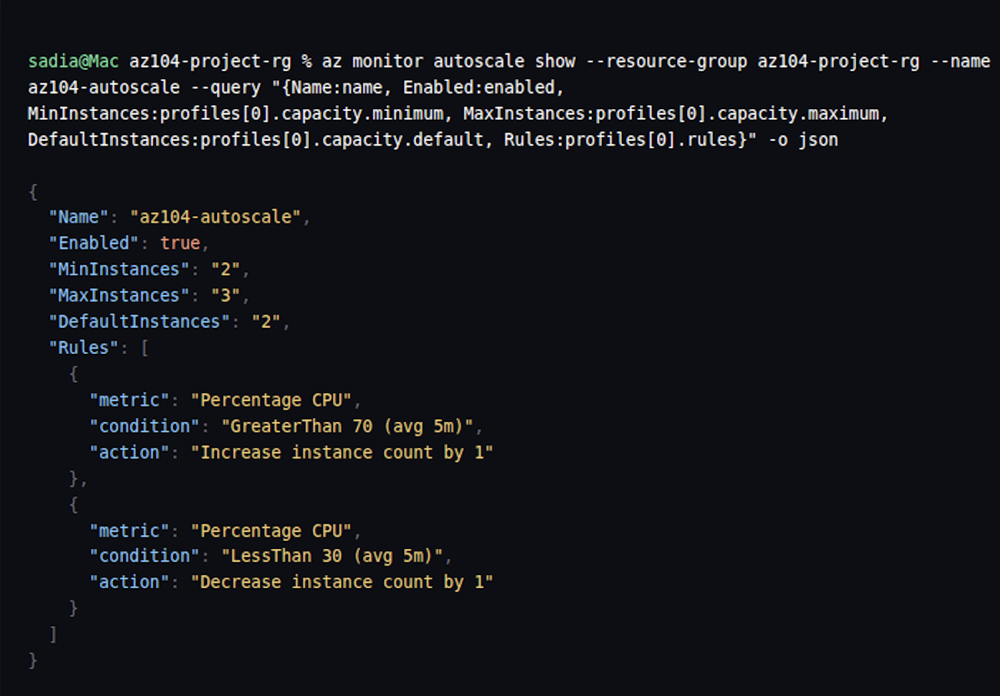
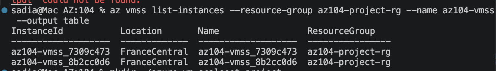
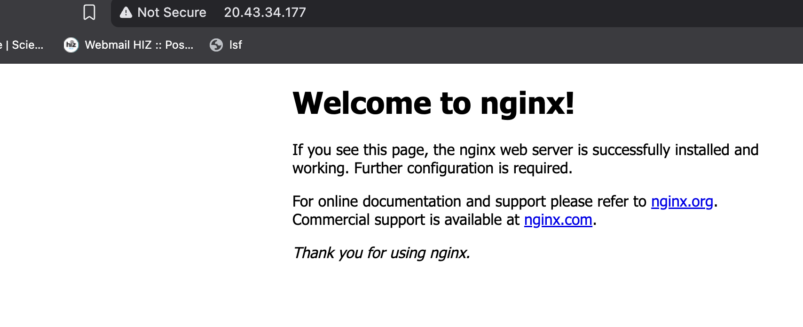

# Azure VM & VM Scale Set with Load Balancing and Autoscaling

A hands-on Azure infrastructure project built while studying for the Microsoft AZ-104 (Azure Administrator Associate) certification. This project provisions a virtual network, a standalone VM, and a VM Scale Set behind a load balancer with CPU-based autoscaling, all via the Azure CLI.

## Overview

This project demonstrates core Azure compute and networking concepts:

- Resource group organization
- Virtual network and subnet design
- Network Security Group (NSG) rules for controlled access
- Deploying a Linux VM with automated software installation via cloud-init
- Deploying a VM Scale Set behind a Standard Load Balancer
- Configuring CPU-based autoscale rules (scale out/in)

## Architecture
                    Internet
                        |
             -----------------------
             |                     |
      Public IP (VM)        Public IP (Load Balancer)
             |                     |
          az104-vm1        Load Balancer (port 80)
          (nginx)                 |
             |            -----------------
             |            |               |
       az104-vnet    vmss instance 1  vmss instance 2
       (10.0.0.0/16)     (nginx)          (nginx)
             |
       az104-subnet
       (10.0.1.0/24)
             |
      NSG: allow SSH (22), allow HTTP (80)

## Prerequisites

- An Azure account (this project was built on Azure for Students)
- Azure CLI installed (`az --version` to check)
- Logged in via `az login`

## Project Structure

| File            | Purpose                                              |
|-----------------|-------------------------------------------------------|
| `deploy.sh`     | Provisions all Azure resources for this project      |
| `cleanup.sh`    | Deletes all resources to avoid ongoing cost           |
| `cloud-init.txt`| Bootstrap script that auto-installs nginx on each VM  |
| `screenshots/`  | Proof-of-work screenshots from the live deployment    |

## How to Deploy

```bash
git clone https://github.com/YOUR-USERNAME/azure-vm-scaleset-project.git
cd azure-vm-scaleset-project
az login
./deploy.sh
```

## Screenshots

# Screenshots





- Single VM serving nginx over its public IP
- Load Balancer distributing traffic across VM Scale Set instances
- Autoscale configuration output
- VM Scale Set instance list

## Troubleshooting / Lessons Learned

- **Region restrictions on free-tier subscriptions:** the initial deployment attempt in `eastus` failed with `RequestDisallowedByAzure`, since Azure for Students subscriptions are restricted to a specific set of allowed regions for capacity/fraud-prevention reasons. Solution: switched to `francecentral`, which was permitted. This is a real constraint worth knowing for the AZ-104 exam and in practice.

## Cleanup

To avoid ongoing charges, delete all resources when done:

```bash
./cleanup.sh
```

This removes the entire resource group and everything inside it in one command.

## Skills Demonstrated (AZ-104 exam objectives)

- Manage Azure identities and governance (resource groups)
- Implement and manage storage (VM disks)
- Deploy and manage Azure compute resources (VMs, VM Scale Sets)
- Configure and manage virtual networking (VNet, subnet, NSG, Load Balancer)
- Monitor and maintain Azure resources (autoscale rules)

## Author

Sadia — built while studying for AZ-104, Microsoft Azure Administrator Associate.
